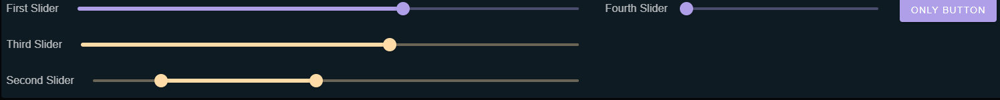

Layout 
======

This document aims to explain how the layout behavior works for components in Zero-True. Defining a 
layout is optional but provides a way to explicitly define the position of components defined in a cell.
By default, each component is rendered in its own row, taking up the full width available. 

Specifying Rows, Cols and Nested Layouts
-----------------------------------------

Zero-True allows you to create complicated nested layouts. These are the docs for columns, rows, and the layout:

.. autopydantic_model:: zero_true.Layout 
    :model-show-field-summary: false
    :model-show-validator-summary: false
.. autopydantic_model:: zero_true.Row 
    :model-show-field-summary: false
    :model-show-validator-summary: false
.. autopydantic_model:: zero_true.Column
    :model-show-field-summary: false
    :model-show-validator-summary: false

Note that that any Rows and Columns defined must be placed inside of a Layout or will not be rendered.

Mixed Layouts
-------------

If some components are placed in a layout and others are not, the layout will accommodate both:

1. Rows defined in the layout will be rendered in the order they are in the list and their subcomponents and columns will be rendered in the order they are defined in the list.
2. All other components not in a row or column will then be rendered in the order they are defined in code and take up the full width available, each in their own row.

Example
-------

Here is an example with actual code that shows how the layout works:

.. code-block:: python 

    import zero_true as zt

    image = zt.Image(id='image', src='https://www.escapemotions.com/images/mainpage/images/blog_posts_bg/landing-page_blog_93303113643.jpg', width=500, height=300)
    slider = zt.Slider(id='slider', label='slider')
    slider2 = zt.Slider(id='slider2', label='slider2')
    slider3 = zt.Slider(id='slider3', label='slider3')
    slider4 = zt.Slider(id='slider4', label='slider4')
    slider5 = zt.Slider(id='slider5', label='slider5')
    button = zt.Button(id='button', text='button')
    button2 = zt.Button(id='button2', text='button2')
    button3 = zt.Button(id='button3', text='button3')
    button4 = zt.Button(id='button4', text='button4')
    button5 = zt.Button(id='button5', text='button5')

    col = zt.Column([slider.id, button.id])
    col2 = zt.Column([slider4.id, button4.id])
    row2 = zt.Row([slider3.id, button3.id, col2])

    row = zt.Row([image.id, slider2.id, button2.id, col])

    zt.Layout([row, row2])

And this is the resulting layout:

    